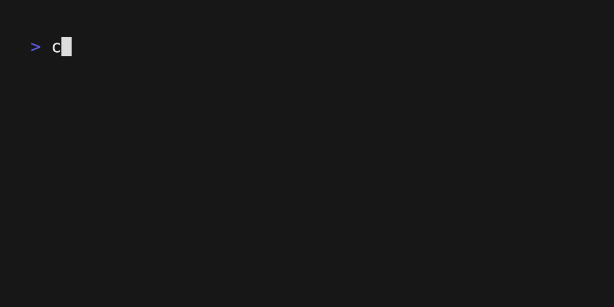

# Sqlite Clone in Rust 🦀
This project is meant to be a two pronged approach at learning Rust with an actual project, practicing actual CS by having to learn how to manipulate low level logic and applying some algorithms that my frontend carreer haven't really require me to do. Thanks to [codecrafters](https://app.codecrafters.io/courses/sqlite?track=rust) Sqlite track for the guidance.



## Features 🏗️
- [x] .dbinfo
- [x] .tables
- [x] .schemas
- [x] base select queries
- [x] index search
- [x] Improve searching speeds
- [x] AND statements
- [x] Pretty printing of tables
- [ ] Introduce table joins
- [ ] Introduce alter tables
- [ ] Add transactions

## Run locally 🫡

If for some reason you are curious about this project, you can just try to play with it locally

```rust
cargo run .dbinfo // Will show you (incomplete) db info
cargo run .tables // Will show all the tables declared in your db first page
cargo run .schemas // Will print a debug of the tables columns
cargo run <select query> // Will get you the data (super slow 🥲)
```
